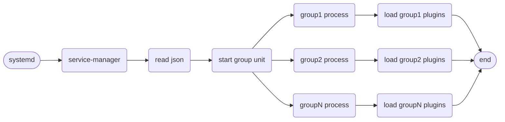
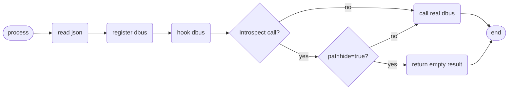
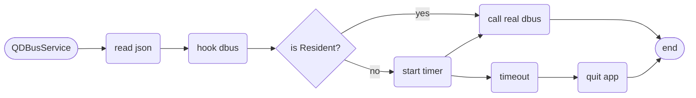

# Deepin 服务框架使用指南

本篇文章将介绍 Deepin 后端服务框架如何使用，以及接口、配置的实现。

## 功能和流程

### 核心功能

- 插件服务，把服务以一个插件方式加载运行
- dbus 路径隐藏功能
- dbus 服务的按需启动
- 独立应用的 dbus 服务管理 sdk

### 加载流程

#### 服务插件加载流程



1. 如图所示，deepin-service-manager 由 systemd 服务拉起来；
2. service 起来后读取所有的 json 配置文件，根据配置文件进行分组；
3. 按照分好的组通过 systemd 启动子进程实例，并传入组名；
4. 子进程启动，按照传入的组名进行过滤，注册该组的服务，并加载服务插件。

#### 路径隐藏流程



1. 进程在启动后会到特定目录读取 json 配置
2. 注册 dbus 服务时，会对 dbus 进行 hook 操作
3. 当 Introspect 接口被调用时，hook 方法会进行拦截，如果配置了 pathhide=true，则返回空结果隐藏路径

#### 独立应用开发流程



1. 独立应用需继承 QDBusService 类
2. 初始化时需指定 json 配置文件，QDBusService 会进行 hook dbus 操作
3. 当配置中指定了按需启动，则在接口被调用时启动定时器，超时即退出进程

## 插件开发

### 提供配置文件

```json
{
  "name": "org.deepin.service.demo",
  "pluginPath": "demo.so",
  "group": "app",
  "pluginType": "qt",
  "version": "1.0",
  "startType": "Resident",
  "idleTime": 10,
  "dependencies": [],
  "startDelay": 0,
  "policy": [
    {
      "path": "/org/deepin/service/demo1"
    },
    {
      "path": "/org/deepin/service/demo2"
    }
  ]
}
```

- <font color=DodgerBlue>name</font>: [必选]dbus name，框架中会注册该 name
- <font color=DodgerBlue>pluginPath</font>: [必选]插件 so 名称
- <font color=DodgerBlue>group</font>: [可选]插件按进程分组 core|dde|app，默认分组为 app
- <font color=DodgerBlue>pluginType</font>: [可选]插件类型，暂时只有 qt 和 sd 两种，默认为 qt
- <font color=DodgerBlue>version</font>: [可选]配置文件版本，预留配置，无实际用途
- <font color=DodgerBlue>startType</font>: [可选]启动方式，Resident（常驻）、OnDemand（按需启动）。默认 Resident。
- <font color=DodgerBlue>idleTime</font>: [可选]若服务是按需启动，则可以设置闲时时间，超时则会退出当前进程，单位为分钟
- <font color=DodgerBlue>dependencies</font>: [可选]若依赖其他服务，可将服务名填在此处，在依赖启动之前不会启动此服务
- <font color=DodgerBlue>startDelay</font>: [可选]若需要延时启动，可将延时时间填在此处，单位为秒
- <font color=DodgerBlue>policy</font>: [可选]配置路径隐藏等设置。对于按需启动的插件，需要配置 Path 用于服务发现。

> 配置文件中必选字段为必须要填写字段，否则插件无法正常启动，可选字段可视情况选择填写即可！

配置文件安装路径规则：

**system**:

```shell
/usr/share/deepin-service-manager/system/demo.json
```

**session**:

```shell
/usr/share/deepin-service-manager/user/demo.json
```

### 实现入口函数

1. qdbus

   ```cpp
   #include <QDBusConnection>
   #include "service.h" // 实现的dbusobject，基本支持qdbus原规则

   static Service *service = nullptr;

   // name:dbus name,配置文件中的"name"，
   // data:自定义数据
   extern "C" int DSMRegister(const char *name, void *data)
   {
       (void)name;
       service = new Service();
       QDBusConnection::RegisterOptions opts =
           QDBusConnection::ExportAllSlots | QDBusConnection::ExportAllSignals |
           QDBusConnection::ExportAllProperties;

       auto connection = reinterpret_cast<QDBusConnection *>(data);
       connection->registerObject("/org/deepin/services/demo1", service, opts);
       return 0;
   }

   // 插件卸载时，若需要释放资源请在此实现
   extern "C" int DSMUnRegister(const char *name, void *data)
   {
       (void)name;
       (void)data;
       service->deleteLater();
       service = nullptr;
       return 0;
   }
   ```

2. sdbus

   ```c
   #include "service.h"

   extern "C" int DSMRegister(const char *name, void *data)
   {
       (void)name;
       if (!data) {
           return -1;
       }
       sd_bus *bus = (sd_bus *)data;
       sd_bus_slot *slot = NULL;
       if (sd_bus_add_object_vtable(bus,
                                   &slot,
                                   "/org/deepin/service/sdbus/demo1",
                                   "org.deepin.service.sdbus.demo1",
                                   calculator_vtable,
                                   NULL) < 0) {
           return -1;
       }
       return 0;
   }

   extern "C" int DSMUnRegister(const char *name, void *data)
   {
       (void)name;
       (void)data;
       return 0;
   }
   ```

**实现的 so 文件安装路径为 `${CMAKE_INSTALL_LIBDIR}/deepin-service-manager/`**

> 不同平台的 lib 路径可能不一样，推荐使用[GNUInstallDirs](https://cmake.org/cmake/help/latest/module/GNUInstallDirs.html?highlight=gnuinstalldirs)

## 独立应用开发

### 提供配置文件

```json
{
  "name": "org.deepin.service.demo",
  "version": "1.0",
  "startType": "Resident",
  "idleTime": 10
}
```

- <font color=DodgerBlue>name</font>: [必选]dbus name，框架中会注册该 name
- <font color=DodgerBlue>version</font>: [可选]配置文件版本，预留配置，无实际用途
- <font color=DodgerBlue>startType</font>: [可选]启动方式，Resident（常驻）、OnDemand（按需启动），默认 Resident。若设置 OnDaemand，则需要设置 idleTime 字段！
- <font color=DodgerBlue>idleTime</font>: [可选]若服务是按需启动，则可以设置闲时时间，超时则会退出当前进程，单位为分钟。

> 独立应用的配置文件与插件的配置文件很多地方不一样，插件中的很多配置，在独立应用中是不生效的！

配置文件安装路径规则：

```shell
/usr/share/deepin-service-manager/other/demo.json
```

### 实现示例

**_QDBusService_**

该类实现了 dbus 权限管控和闲时退出功能，使用该类非常自由：

- 可以继承该类
- 可以单独创建该类实例

1.  DBus Interface 类继承该类：

    ```cpp
    class ServiceInterface : public QDBusService
    {
        Q_OBJECT
        Q_CLASSINFO("D-Bus Interface", ServiceInterfaceStr);

    public:
        explicit ServiceInterface(QObject *parent = nullptr);
        void init(const QDBusConnection::BusType &type) {
            initPolicy(type, QString(SERVICE_CONFIG_DIR) + "other/demo.json");
        }
    };

    ```

    然后直接创建该类实例，并用该类进行 DBus 注册即可，如：

    ```cpp
    if (!connection.registerObject(ServiceInterfacePath,
                                   serviceInterfaceInstance,
                                   QDBusConnection::ExportScriptableContents
                                           | QDBusConnection::ExportAllProperties)) {
        qWarning() << "[ServiceManager]failed to register dbus object: "
                   << connection.lastError().message();
    }
    ```

2.  使用 DBus Adaptor 方式进行注册：

    ```cpp
    class Service : public QDBusService, protected QDBusContext
    {
        Q_OBJECT
    public:
        explicit Service(QObject *parent = nullptr) {
                initPolicy(QDBusConnection::SessionBus,
                    QString(SERVICE_CONFIG_DIR) + "other/demo.json");
        }

        Q_PROPERTY(QString msg READ Msg WRITE SetMsg NOTIFY MsgChanged)
        QString Msg();
        void SetMsg(QString value);

    Q_SIGNALS:
        // xml - signal
        void MsgChanged(const QString &msg);

    public Q_SLOTS:
        // xml - method
        QString Hello();

    private:
        QString m_msg;
    };

    ```

    然后使用 adaptor 进行注册：

    ```cpp
    Service s;
    DemoAdaptor adp(&s);
    // 从QDBusService对象拿到 QDBusConnection 防止注册对象不一致，导致无法正常管理权限
    QDBusConnection connection = s.qDbusConnection();
    if (!connection.registerObject("/org/deepin/service/demo", &s)) {
        qWarning() << "failed to register dbus object" << connection.lastError().message();
    }
    ```

3.  单独使用该类：

    ```cpp
    QDBusService service;
    service.initPolicy(QDBusConnection::SessionBus,
        QString(SERVICE_CONFIG_DIR) + "other/demo.json");
    ```

    可以将这段代码放在任何类里。

> 独立应用若需要按需启动，需要安装 DBus service 文件，注意`Exec`字段要填写自己可执行程序的路径！

### API 说明

```cpp
QDBusService::initPolicy(const QDBusConnection::BusType&, const QString&)
```

初始化配置，需要指定 DBus 类型和配置文件路径。
<br><br>

```cpp
QDBusService::qDbusConnection()
```

获取 QDBusConnection 对象，为保持服务总线在一个对象上，务必不要使用默认的 QDBusConnection，而是从这里获取。
<br><br>

```cpp
QDBusService::lockTimer(bool)
```

是否锁定计时器，若锁定计时器，则在解锁前不会执行闲时退出操作。参数为`true`是锁定，否则解锁。

## 插件与独立应用的区别

1. 插件统一由主框架进行管理，独立应用由应用自己管理
2. 插件提供进程合并的机制，独立应用没有
3. 插件适合纯后端服务，独立应用可以是后端服务，也可以是前端 ui 程序
4. 主服务会根据配置对插件进行一些辅助功能添加，独立应用只需继承类，尽量不改变原有 DBus 注册方式（所以独立应用中需要自己 registerService，而插件不需要）
5. 插件只能由配置字段来进行控制，独立应用可以通过配置+接口的方式进行控制，所以更加灵活

## 路径隐藏功能

框架支持隐藏 DBus 路径的功能，隐藏的路径在 Introspect 时不会显示，但仍然可以被调用。

```json
{
  ...
  "policy": [
    {
      "path": "/qdbus/demo1",
      "pathhide": true,
      "subpath": true
    },
    {
      "path": "/qdbus/demo2", 
      "pathhide": false
    }
  ]
}
```

- <font color=DodgerBlue>policy</font>: 路径配置
  - <font color=DodgerBlue>path</font>: object path，指定哪个 path 要进行配置
  - <font color=DodgerBlue>pathhide</font>: 隐藏该 path，但可调用。可选，默认 false
  - <font color=DodgerBlue>subpath</font>: 子 path 也应用该设置（针对动态生成的子路径）。可选，默认 false

> 注意：基于进程路径的权限管控功能已被移除，因为此机制存在安全隐患。

## 查看插件是否生效

将 .so 和 .json 文件放到指定位置后，执行命令：

1. system

   ```bash
   sudo systemctl restart deepin-service-manager.service
   ```

2. session

   ```bash
   systemctl --user restart deepin-service-manager.service
   ```

重启服务后，即可通过 DBus 命令行或 d-feet 工具查看 json 中的 DBus 服务已被启动，服务名即 json 中的`name`字段配置的内容。

在`org.deepin.ServiceManager1`服务中：

- `/org/deepin/ServiceManager1`路径下可查看当前服务中已启动的所有分组进程
- `/org/deepin/Group1/<group name>`路径下可查看当前分组中加载的所有插件

## 注意事项

当`startType`为`Resident`时，插件会以常驻的方式进行启动，并且开机自启。

当`startType`为`OnDemand`时，插件需要依赖`DBus`服务拉起，所以需要安装一个 DBus service 文件
该文件可以自己写，也可以自定义函数辅助生成：

```cmake
function (install_dbus_service arg)
    if (${ARGC} EQUAL 1)
        file(GENERATE OUTPUT ${CMAKE_CURRENT_BINARY_DIR}/${ARGV0}.service CONTENT "[D-BUS Service]\nName=${ARGV0}\nExec=/usr/bin/deepin-service-manager -n ${ARGV0}\nSystemdService=deepin-service-plugin@${ARGV0}.service")
        install(FILES ${CMAKE_CURRENT_BINARY_DIR}/${ARGV0}.service DESTINATION ${CMAKE_INSTALL_FULL_DATADIR}/dbus-1/services)
    endif()
    if (${ARGC} EQUAL 2)
        file(GENERATE OUTPUT ${CMAKE_CURRENT_BINARY_DIR}/${ARGV0}.service CONTENT "[D-BUS Service]\nName=${ARGV0}\nExec=/usr/bin/deepin-service-manager -n ${ARGV0}\nUser=root\nSystemdService=deepin-service-plugin@${ARGV0}.service")
        install(FILES ${CMAKE_CURRENT_BINARY_DIR}/${ARGV0}.service DESTINATION ${CMAKE_INSTALL_FULL_DATADIR}/dbus-1/system-services)
    endif()
endfunction ()

install_dbus_service(org.deepin.ServiceName)
```

若是 system 级服务，还需要加一个参数：

```cmake
install_dbus_service(org.deepin.ServiceName root)
```

若是手写一个 DBus service 文件，以下是一个参考例子：

```ini
[D-BUS Service]
Name=org.deepin.service.demo
Exec=/usr/bin/deepin-service-manager -n org.deepin.service.demo
User=root
SystemdService=deepin-service-plugin@org.deepin.service.demo.service
```

若需要注册 system 级别 DBus，还需要安装 conf 文件让 DBus 服务能够有权限进行注册，以下是一个例子：

```xml
<?xml version="1.0" encoding="UTF-8"?> <!-- -*- XML -*- -->

<!DOCTYPE busconfig PUBLIC
 "-//freedesktop//DTD D-BUS Bus Configuration 1.0//EN"
 "http://www.freedesktop.org/standards/dbus/1.0/busconfig.dtd">
<busconfig>

  <!-- Only root can own the service -->
  <policy user="root">
    <allow own="org.deepin.ServiceManager1"/>
    <allow send_destination="org.deepin.ServiceManager1"/>
  </policy>

  <!-- Allow anyone to invoke methods on the interfaces -->
  <policy context="default">
    <allow send_destination="org.deepin.ServiceManager1"/>
  </policy>

</busconfig>
```

## 调试方法

在该服务中，分为主服务与分组服务，主服务启动，会根据配置文件，自动启动分组服务，举个例子：

现有一个插件，json 配置中，`group`字段配置为`app`，那么该插件就属于`app`组，主服务启动时会自动按组名启动插件服务，插件服务的名称为：

```bash
deepin-service-group@app.service
```

所以在调试时，只需启动插件服务即可：

```bash
sudo systemctl restart deepin-service-group@app.service
```

对于非常驻插件，可以单独进程启动：

```bash
sudo systemctl restart deepin-service-plugin@org.deepin.service.demo.service
```

### 查看日志

若是常驻应用，可按自己的分组查看：

```bash
sudo journalctl -x -e -u deepin-service-group@app.service
```

若是临时应用，可按服务名称查看：

```bash
sudo journalctl -x -e -u deepin-service-plugin@org.deepin.service.demo.service
```

## demo 请参考[这里](src/demo)

## 更新日志

- 2023/03/17:
  - 添加插件和独立应用的区别
- 2023/03/16:
  - 支持插件以临时进程进行启动
  - 服务名称改名：deepin-service-plugin -> deepin-service-group
  - 优化注意事项，建议详细查看注意事项
  - 新增日志查看方式
  - 优化配置代码，字段说明提取到外面，方便复制
- 2023/02/22:
  - 新增权限管控流程和独立应用开发流程
  - 新增注意事项，调试技巧可参考注意事项
  - 新增附件列表，实现了常见场景的 demo
  - 优化整体页面说明，分为插件开发、独立应用开发以及如何给插件或应用加上权限管控
- 2023/02/08:
  - 新增依赖配置，配置依赖服务后，在依赖未启动时不会启动本服务
  - 新增延时启动，可配置本服务延时启动
- 2023/02/06:
  - 重命名入口函数 DSMRegisterObject->DSMRegister;
  - 新增卸载函数，用于释放内存：DSMUnRegister;
  - json 配置路径更新：去掉了路径中的`qt-service`和`sd-service`，转而使用 json 文件中的`pluginType`来匹配。
